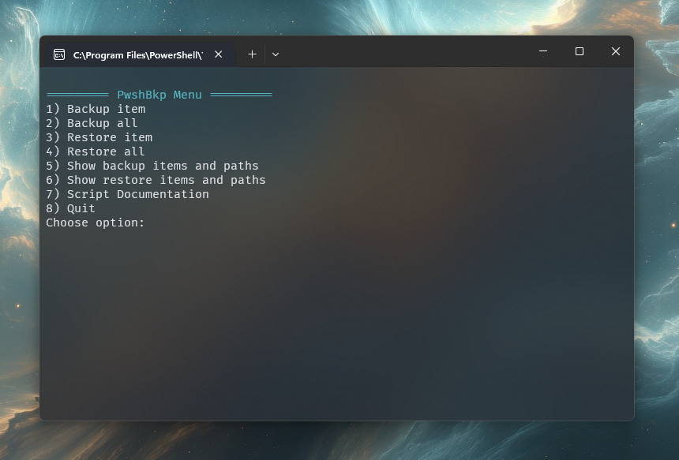

# 💾 PwshBkp.ps1

A PowerShell backup script to quickly copy files and directories to a given location.

---

## 🖼️ Screenshot

---

## 📌 What This Does

- Backs up your config folders into `Desktop\CfgBackup_YYMMDD` (each item gets its own subfolder).
- Also creates `Desktop\CfgBackup_YYMMDD.zip` that **includes this script** for convenience.
- Restores from a chosen backup **folder** (not directly from `.zip`).

---

## 📥 Backup

- **Backup item** – choose one logical item to copy into today's backup folder.
- **Backup all** – copies all `$IncludePaths` into today's backup folder.
- After copying:
  - The script file is copied into the folder.
  - A `.zip` is created next to the folder.

---

## ♻️ Restore

- Auto-detects backup root in this order:
  1. If the script lives inside a `CfgBackup_*` folder anywhere, use that.
  2. Newest `CfgBackup_*` folder on your Desktop.
  3. Otherwise, you’re prompted to enter a path.
- **Restore item** – choose one user-dir item to restore.
- **Restore all** – restores all user-dir items.
- **Note:** You must unzip if you only have a `.zip`; restore works on folders.

---

## ⚙️ Safe to Edit

- Edit `$IncludePaths` to add or remove items.
- Restore never deletes files; it copies over using `robocopy`, preserving timestamps and attributes.

---

## 🛠️ To-Do & Contribution

- Add incremental backup support.
- Option to keep a fixed number of backups in a chosen folder.

If you find bugs or have ideas for improvements, please open an issue.  
Pull requests are always welcome!

---
